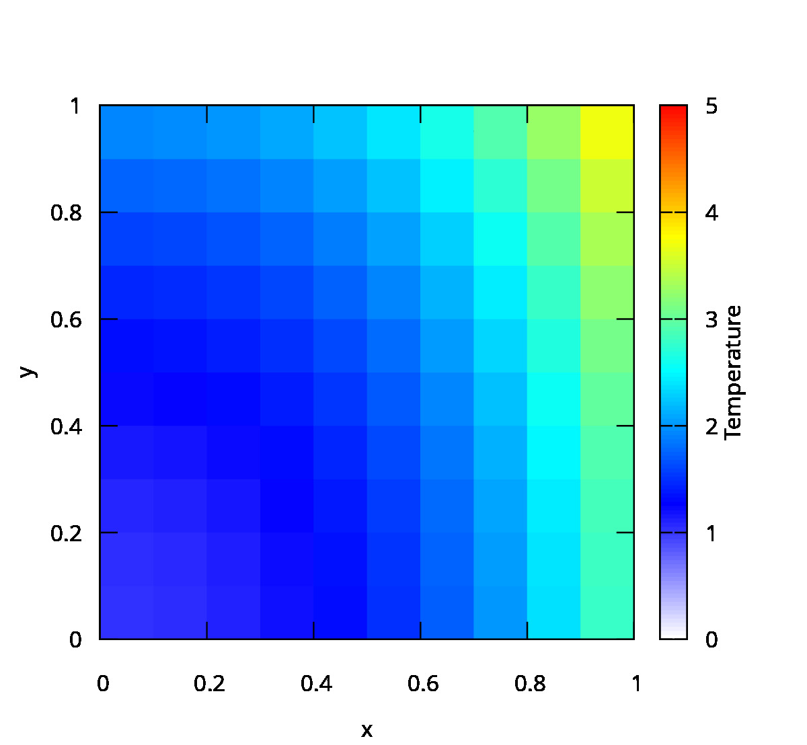
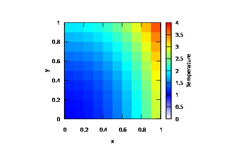

# Numerical integration of partial differential equations

This repository contains the code of two types of code:

- Exercises done in `Octave`
- Theoretical exercises done in `LaTeX`
- The project of the course

The project consists in integrating the heat equation in a 2D plate with two different method, both using finite difference. The first one is a explicit method, the second one is the implicit method of Crank-Nicolson.

### Requirements for the project

- `gcc` compiler
- `make`
- `gnuplot`
- `magick` for creating a gif

### Usage of the code

First download the code and compile it:

```
git clone git@github.com:mathUAB/integracio-numerica-edps.git
cd integracio-numerica-edps
chmod +x plot.sh
make
```

Then run the code with appropriate arguments. For example:

```
./bin/main ...
./plot.sh
```

Type `./bin/main` for more information about the arguments.

### Results

Here are the results, when heating up the plate from the center with a source of constant heat:

<!--  -->


